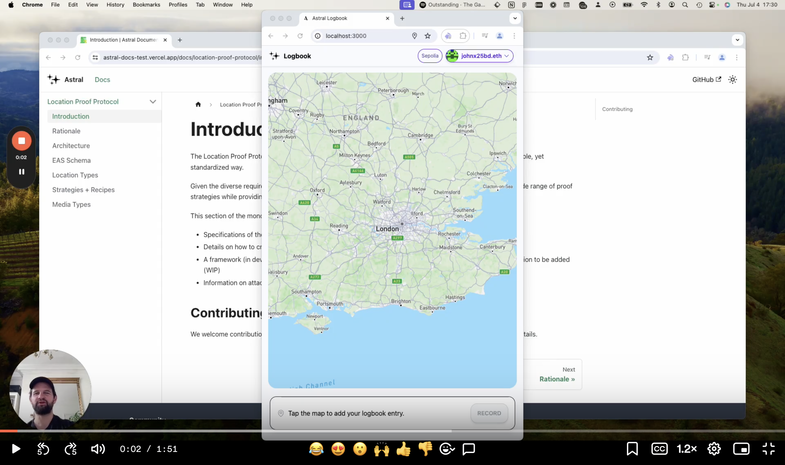

# 🧭 Astral Logbook

The Astral Logbook is a decentralized application built on Astral's Location Proof Protocol.

With the Logbook, users can:

- record geotagged entries
- store log entries onchain
- include a text memo in their entries
- attach content to an entry
- explore an interactive map of entries posted around the world (soon!)
- verify friends' entries (soon!)
- share to decentralized social media (soon!)

Watch a quick intro to the Logbook here:

<a href="https://www.loom.com/share/f1ad5b18db5f444688ccf949ac8fa1bd?sid=52720614-8ac7-4041-bb73-b646f4c58f7b" target="_blank">
  
</a>

You can find documentation about the Location Proof Protocol [here](https://astral-docs-test.vercel.app/docs/location-proof-protocol/introduction).

## Deployment Guide

To integrate code to create or read location proofs, see the [Location Proof Protocol documentation](https://docs.astral.global/docs/location-proof-protocol/quickstart).

This guide is for deploying another instance of the Logbook frontend.

1. **Fork & Clone**

   - Fork this repository on GitHub
   - Clone your fork: `git clone https://github.com/YOUR_USERNAME/logbook.git`
   - Add upstream remote: `git remote add upstream https://github.com/astralprotocol/logbook.git`
2. **Build & Configure**

   - Install dependencies: `yarn install`
   - In `/packages/nextjs/`, Copy `.env.example` to `.env.local`
   - Configure your environment variables
3. **Deploy**
   The easiest way to deploy is using Vercel:

   - Connect your GitHub repository to Vercel
   - Configure environment variables in Vercel dashboard
   - Vercel will automatically build and deploy on push to `main`

To keep your fork updated:

```bash
git fetch upstream
git merge upstream/main
```

## Environment Variables

The following environment variables are required to run this project. For the nextjs package:

```
NEXT_PUBLIC_MAPBOX_TOKEN=""
NEXT_PUBLIC_GATEWAY_URL=""
PINATA_JWT=""
```

---

The Logbook was built using Scaffold-ETH 2 — huge thanks to the BuidlGuidl for this resource!
